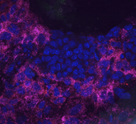
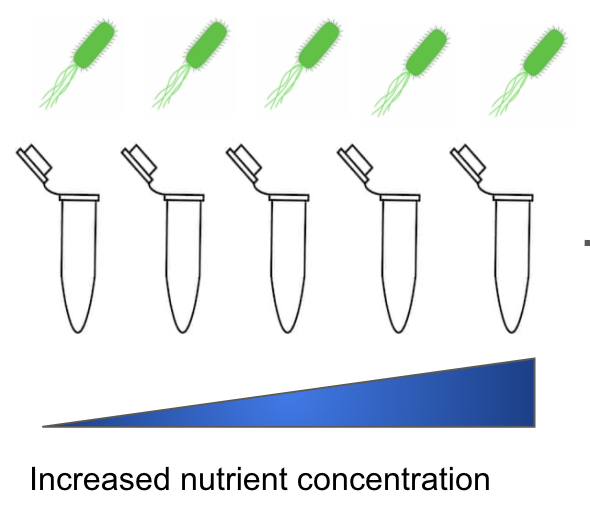
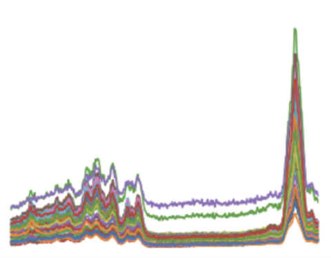

 

# The KCO Machine Learning Challenge 2020

   

## Cell classification using Raman spectroscopy

### Introduction
Thank you for your interest in our machine learning challenge! In this challenge, you will build a model for classifing cells exposed to different nutrient concentrations. Individual cells exhibit a variety of features: some of them determine the *cell type* (*e.g.* liver cells are different than brain cells); some others determine the *cell state* (*e.g.* are cells exposed to high concentration of nutrients or are they starving?). Leveraging AI models to determine the cell state is an essential problem for the construction of a [Human Cell Atlas project](https://www.humancellatlas.org/), which is among the main interests of our lab. 

The purpose of this challenge is to pre-screen candidates for a COOP internship at the Klarman Cell Observatory. We sincerely hope you will join us!

### Challenge Description
You will code a machine learning model to classify *E. coli* bacteria from their Raman spectra. The bacteria have been divided into 4 different groups of varying concentration of the nutrient [cAMP](https://en.wikipedia.org/wiki/Cyclic_adenosine_monophosphate). Changing the amount of the nutrient will change how  genes are expressed in each cell, putting the four groups into four different cell states. For each condition, we obtained the [Raman spectra](https://en.wikipedia.org/wiki/Raman_spectroscopy) (Raman is pronounced *Rah-mon*) from single bacterial cells: your goal is to determine whether the four groups can be distinguished using Raman spectra.

 

### Data structure
We have provided the data for this challenge in `data/raman_data.csv`.

The data is formatted as follows:
- Each of the 223 rows contains the group (field `condition` - these are the labels) and Raman spectra of a cell (second column onward - these are the features). 
- In each row there are 1286 Raman features that are ordered (the column names correspond to each measured wavelength). 
- The label names are $0mM$, $0.1mM$, $0.5mM$, $1mM$ and refer to nutrient concentration (_ie_ $1mM$ means that cells are exposed to more nutrient than $0.5mM$). 

### Your submission
**Please submit a Jupyter notebook by Sep XX. The notebook should include a detailed analysis of our data, the machine learning methods you used and your scientific conclusions.**

Consider the following points in your analysis: 

- Load the data from`data/raman_data.csv`. Choose a way to visualize the dataset and describe it.
- Pre-process the data:
    - Some Raman features possess outliers: can you remove them?
    - Only a subset of Raman features are biologically relevant: those whose wavelengths are in between $800 cm^{-1}$ and $1800 cm^{-1}$. Please restrict your analysis to those features.
    - Make sure you standardize your data (_ie_ zero mean, unit variance) if you use a machine learning model that requires it.
- Train a classifier that predicts the `condition` given as input the Raman features.
    - You can use a simple model from an existing library such as sklearn.
    - We would welcome if you coded your own model using a framework such as Keras or PyTorch.
    - Explain what loss function you are using and why.
- Evaluate the performance of the classifier.
    - Make sure you clearly define in the notebook the training set and the test set.
    - Which evaluation metric are you using and why? Are you monitoring false negatives and false positives? 
    - When you evaluate your model, we would welcome if you perform a K-fold validation (_ie_ averaging model perfomance over various train/test sets).
- Interpret why the classifier is making decisions.
    - Can you analyze the feature importance? (_ie_ which wavelength is more relevant for classification purposes).
- Build a pairwise classifier (as opposed to the multi-class of the previous point):
    - Build a classifier that distinguishes between _pairs_ of conditions (_eg_ $0mM$ vs $1mM$). 
    - Quantify how well the classifier distinguishes each pair: is it easier for the model to distinguish between two similar, or different, nutrient concentrations?
    - Produce a figure that shows your findings.
- Clearly state your scientifically-sound conclusions based on the results and visuals.

When you're finished, please place this notebook and any other code you wrote into a zipped folder and e-mail to Tommaso Biancalani <tbiancal@broadinstitute.org>. 
